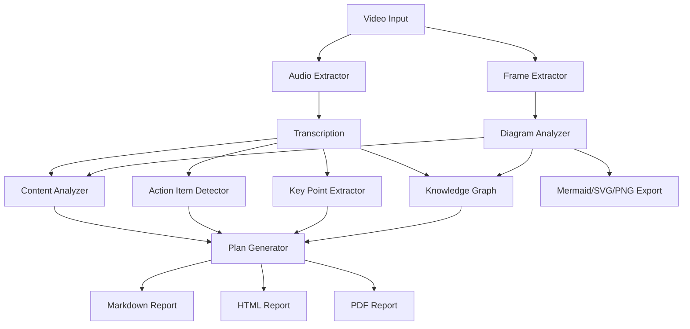

# Architecture Overview

## System diagram



## Module structure

```
video_processor/
├── cli/                    # CLI commands (Click)
│   └── commands.py
├── extractors/             # Media extraction
│   ├── frame_extractor.py  # Video → frames
│   └── audio_extractor.py  # Video → WAV
├── analyzers/              # AI-powered analysis
│   ├── diagram_analyzer.py # Frame classification + extraction
│   ├── content_analyzer.py # Cross-referencing
│   └── action_detector.py  # Action item detection
├── integrators/            # Knowledge assembly
│   ├── knowledge_graph.py  # Entity/relationship graph
│   └── plan_generator.py   # Report generation
├── providers/              # AI provider abstraction
│   ├── base.py             # BaseProvider ABC
│   ├── openai_provider.py
│   ├── anthropic_provider.py
│   ├── gemini_provider.py
│   ├── discovery.py        # Auto-model-discovery
│   └── manager.py          # ProviderManager routing
├── utils/
│   ├── json_parsing.py     # Robust LLM JSON parsing
│   ├── rendering.py        # Mermaid + chart rendering
│   ├── export.py           # HTML/PDF export
│   ├── api_cache.py        # Disk-based response cache
│   └── prompt_templates.py # LLM prompt management
├── models.py               # Pydantic data models
├── output_structure.py     # Directory layout + manifest I/O
└── pipeline.py             # Core processing pipeline
```

## Key design decisions

- **Pydantic everywhere** — All structured data uses pydantic models for validation and serialization
- **Manifest-driven** — Every run produces `manifest.json` as the single source of truth
- **Provider abstraction** — Single `ProviderManager` wraps OpenAI, Anthropic, Gemini behind a common interface
- **No hardcoded models** — Model lists come from API discovery
- **Screengrab fallback** — When extraction fails, save the frame as a captioned screenshot
