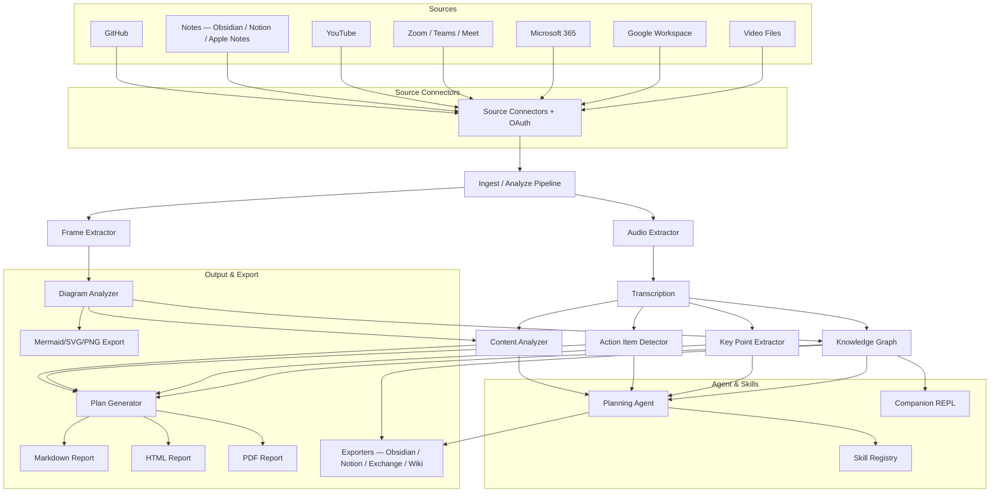

# Architecture Overview

## System diagram


```mermaid
graph TD
    subgraph Sources
        S1[Video Files]
        S2[Google Workspace]
        S3[Microsoft 365]
        S4[Zoom / Teams / Meet]
        S5[YouTube]
        S6[Notes — Obsidian / Notion / Apple Notes]
        S7[GitHub]
    end

    subgraph Source Connectors
        SC[Source Connectors + OAuth]
    end

    S1 --> SC
    S2 --> SC
    S3 --> SC
    S4 --> SC
    S5 --> SC
    S6 --> SC
    S7 --> SC

    SC --> A[Ingest / Analyze Pipeline]

    A --> B[Frame Extractor]
    A --> C[Audio Extractor]
    B --> D[Diagram Analyzer]
    C --> E[Transcription]
    D --> F[Knowledge Graph]
    E --> F
    E --> G[Key Point Extractor]
    E --> H[Action Item Detector]
    D --> I[Content Analyzer]
    E --> I

    subgraph Agent & Skills
        AG[Planning Agent]
        SK[Skill Registry]
        CO[Companion REPL]
    end

    F --> AG
    G --> AG
    H --> AG
    I --> AG
    AG --> SK
    F --> CO

    F --> J[Plan Generator]
    G --> J
    H --> J
    I --> J

    subgraph Output & Export
        J --> K[Markdown Report]
        J --> L[HTML Report]
        J --> M[PDF Report]
        D --> N[Mermaid/SVG/PNG Export]
        EX[Exporters — Obsidian / Notion / Exchange / Wiki]
    end

    AG --> EX
    F --> EX
```

## Module structure

```
video_processor/
├── cli/                    # CLI commands (Click)
│   └── commands.py
├── sources/                # Source connectors
│   ├── gdrive.py           # Google Drive
│   ├── gws.py              # Google Workspace (Docs, Sheets, Slides, Meet)
│   ├── m365.py             # Microsoft 365 (OneDrive, SharePoint, Teams)
│   ├── dropbox.py          # Dropbox
│   ├── zoom.py             # Zoom recordings
│   ├── youtube.py          # YouTube videos
│   ├── notion.py           # Notion pages
│   ├── github.py           # GitHub repos / wikis
│   ├── obsidian.py         # Obsidian vaults
│   └── apple_notes.py      # Apple Notes (macOS)
├── extractors/             # Media extraction
│   ├── frame_extractor.py  # Video → frames
│   └── audio_extractor.py  # Video → WAV
├── analyzers/              # AI-powered analysis
│   ├── diagram_analyzer.py # Frame classification + extraction
│   ├── content_analyzer.py # Cross-referencing
│   └── action_detector.py  # Action item detection
├── integrators/            # Knowledge assembly
│   ├── knowledge_graph.py  # Entity/relationship graph
│   ├── graph_query.py      # Query engine
│   └── plan_generator.py   # Report generation
├── agent/                  # Planning agent
│   ├── agent.py            # Agent loop
│   ├── skills.py           # Skill registry
│   └── companion.py        # Companion REPL
├── exporters/              # Export formats
│   ├── markdown.py         # Markdown export
│   ├── obsidian.py         # Obsidian vault export
│   ├── notion.py           # Notion export
│   ├── wiki.py             # Wiki generation + push
│   └── exchange.py         # PlanOpticon Exchange Format
├── providers/              # AI provider abstraction
│   ├── base.py             # BaseProvider ABC
│   ├── openai_provider.py
│   ├── anthropic_provider.py
│   ├── gemini_provider.py
│   ├── ollama_provider.py  # Local Ollama (offline)
│   ├── azure_provider.py   # Azure OpenAI
│   ├── together_provider.py
│   ├── fireworks_provider.py
│   ├── cerebras_provider.py
│   ├── xai_provider.py     # xAI / Grok
│   ├── discovery.py        # Auto-model-discovery
│   └── manager.py          # ProviderManager routing
├── utils/
│   ├── json_parsing.py     # Robust LLM JSON parsing
│   ├── rendering.py        # Mermaid + chart rendering
│   ├── export.py           # HTML/PDF export
│   ├── api_cache.py        # Disk-based response cache
│   └── prompt_templates.py # LLM prompt management
├── auth.py                 # OAuth flow management
├── exchange.py             # Exchange format schema
├── models.py               # Pydantic data models
├── output_structure.py     # Directory layout + manifest I/O
└── pipeline.py             # Core processing pipeline
```

## Key design decisions

- **Pydantic everywhere** — All structured data uses pydantic models for validation and serialization
- **Manifest-driven** — Every run produces `manifest.json` as the single source of truth
- **Provider abstraction** — Single `ProviderManager` wraps OpenAI, Anthropic, Gemini, Ollama, and additional providers behind a common interface
- **No hardcoded models** — Model lists come from API discovery
- **Screengrab fallback** — When extraction fails, save the frame as a captioned screenshot
- **OAuth-first auth** — All cloud service integrations use OAuth via `planopticon auth`, with credentials stored locally. Service account keys are supported as a fallback for server-side automation
- **Skill registry** — The planning agent discovers and invokes skills dynamically. Skills are self-describing and can be composed by the agent to accomplish complex tasks
- **Exchange format** — A portable JSON format (`exchange.py`) for importing and exporting knowledge graphs between PlanOpticon instances and external tools
