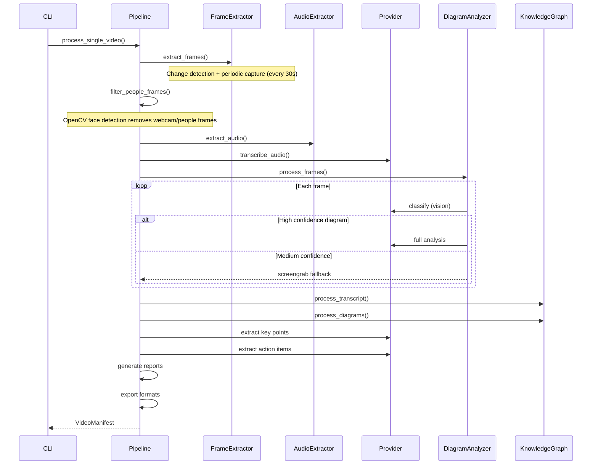

# Processing Pipeline

## Single video pipeline

## Batch pipeline

The batch command wraps the single-video pipeline:

1. Scan input directory for matching video files
2. For each video: `process_single_video()` with error handling
3. Merge knowledge graphs across all completed videos
4. Generate batch summary with aggregated stats
5. Write batch manifest

## Error handling

- Individual video failures don't stop the batch
- Failed videos are logged with error details in the manifest
- Diagram analysis failures fall back to screengrabs
- LLM extraction failures return empty results gracefully
