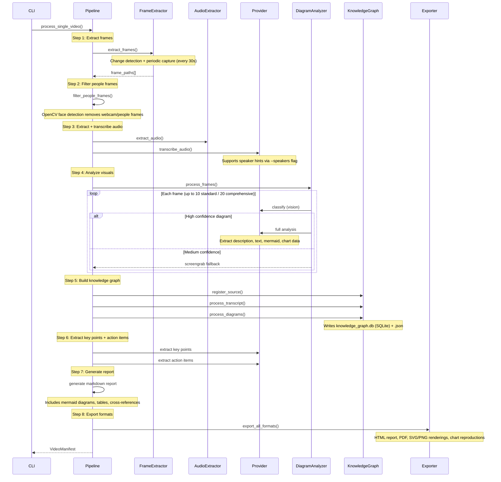
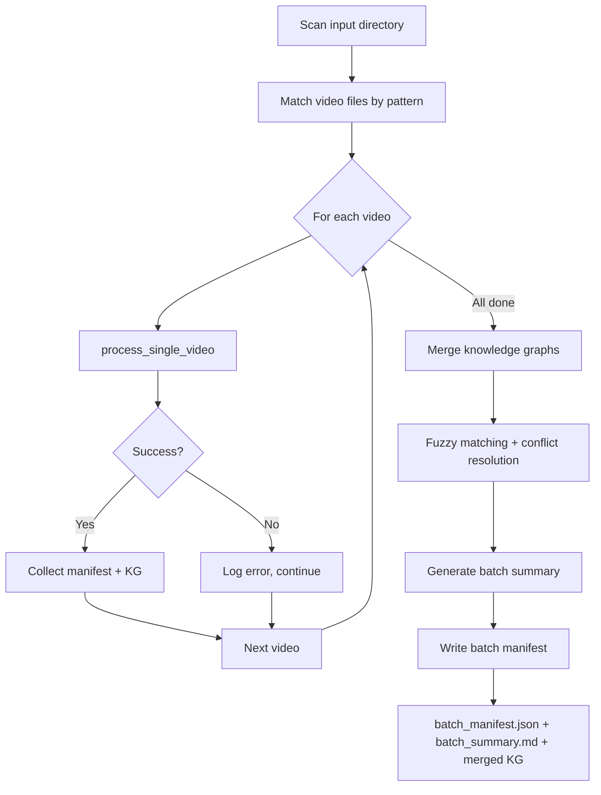
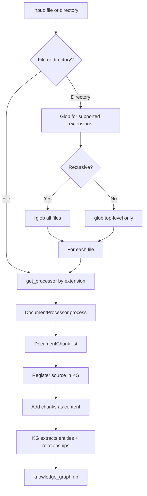
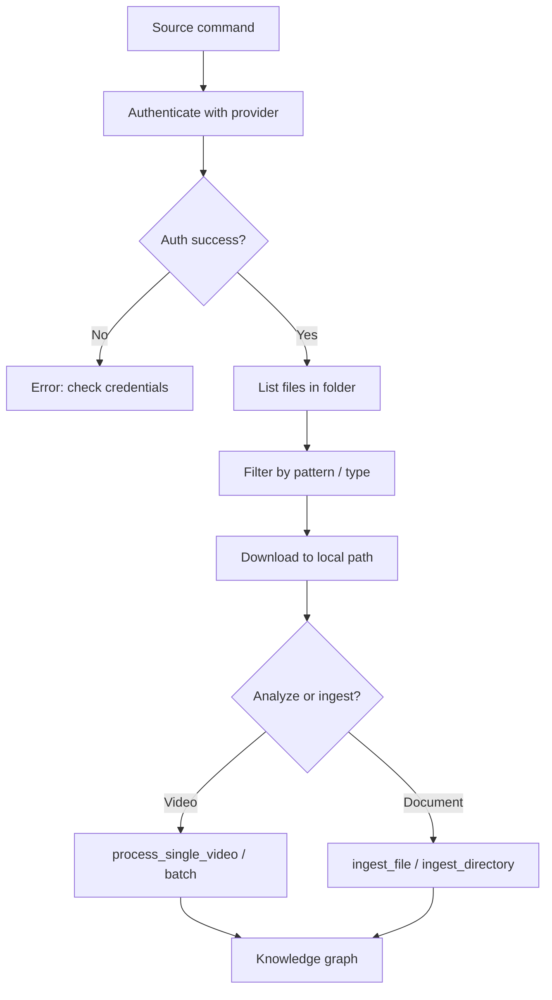
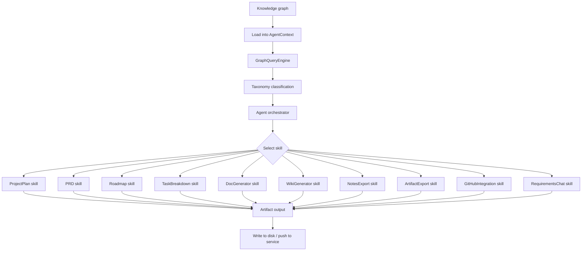
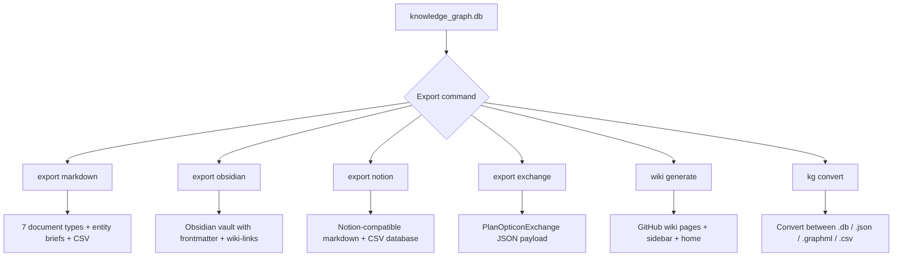
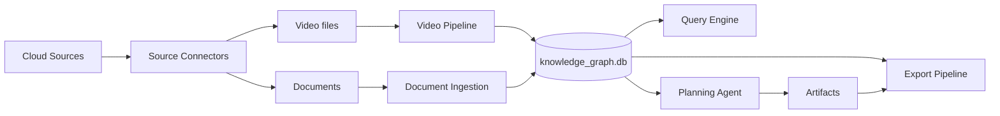

# Processing Pipeline

PlanOpticon has four main pipelines: **video analysis**, **document ingestion**, **source connector**, and **export**. Each pipeline can operate independently, and they connect through the shared knowledge graph.

---

## Single video pipeline

The core video analysis pipeline processes a single video file through eight sequential steps with checkpoint/resume support.


```mermaid
sequenceDiagram
    participant CLI
    participant Pipeline
    participant FrameExtractor
    participant AudioExtractor
    participant Provider
    participant DiagramAnalyzer
    participant KnowledgeGraph
    participant Exporter

    CLI->>Pipeline: process_single_video()

    Note over Pipeline: Step 1: Extract frames
    Pipeline->>FrameExtractor: extract_frames()
    Note over FrameExtractor: Change detection + periodic capture (every 30s)
    FrameExtractor-->>Pipeline: frame_paths[]

    Note over Pipeline: Step 2: Filter people frames
    Pipeline->>Pipeline: filter_people_frames()
    Note over Pipeline: OpenCV face detection removes webcam/people frames

    Note over Pipeline: Step 3: Extract + transcribe audio
    Pipeline->>AudioExtractor: extract_audio()
    Pipeline->>Provider: transcribe_audio()
    Note over Provider: Supports speaker hints via --speakers flag

    Note over Pipeline: Step 4: Analyze visuals
    Pipeline->>DiagramAnalyzer: process_frames()
    loop Each frame (up to 10 standard / 20 comprehensive)
        DiagramAnalyzer->>Provider: classify (vision)
        alt High confidence diagram
            DiagramAnalyzer->>Provider: full analysis
            Note over Provider: Extract description, text, mermaid, chart data
        else Medium confidence
            DiagramAnalyzer-->>Pipeline: screengrab fallback
        end
    end

    Note over Pipeline: Step 5: Build knowledge graph
    Pipeline->>KnowledgeGraph: register_source()
    Pipeline->>KnowledgeGraph: process_transcript()
    Pipeline->>KnowledgeGraph: process_diagrams()
    Note over KnowledgeGraph: Writes knowledge_graph.db (SQLite) + .json

    Note over Pipeline: Step 6: Extract key points + action items
    Pipeline->>Provider: extract key points
    Pipeline->>Provider: extract action items

    Note over Pipeline: Step 7: Generate report
    Pipeline->>Pipeline: generate markdown report
    Note over Pipeline: Includes mermaid diagrams, tables, cross-references

    Note over Pipeline: Step 8: Export formats
    Pipeline->>Exporter: export_all_formats()
    Note over Exporter: HTML report, PDF, SVG/PNG renderings, chart reproductions

    Pipeline-->>CLI: VideoManifest
```

### Pipeline steps in detail

| Step | Name | Checkpointable | Description |
|------|------|----------------|-------------|
| 1 | Extract frames | Yes | Change detection + periodic capture. Skipped if `frames/frame_*.jpg` exist on disk. |
| 2 | Filter people frames | No | Inline with step 1. OpenCV face detection removes webcam frames. |
| 3 | Extract + transcribe audio | Yes | Skipped if `transcript/transcript.json` exists. Speaker hints passed if `--speakers` provided. |
| 4 | Analyze visuals | Yes | Skipped if `diagrams/` is populated. Evenly samples frames (not just first N). |
| 5 | Build knowledge graph | Yes | Skipped if `results/knowledge_graph.db` exists. Registers source, processes transcript and diagrams. |
| 6 | Extract key points + actions | Yes | Skipped if `results/key_points.json` and `results/action_items.json` exist. |
| 7 | Generate report | Yes | Skipped if `results/analysis.md` exists. |
| 8 | Export formats | No | Always runs. Renders mermaid to SVG/PNG, reproduces charts, generates HTML/PDF. |

---

## Batch pipeline

The batch pipeline wraps the single-video pipeline and adds cross-video knowledge graph merging.


```mermaid
flowchart TD
    A[Scan input directory] --> B[Match video files by pattern]
    B --> C{For each video}
    C --> D[process_single_video]
    D --> E{Success?}
    E -->|Yes| F[Collect manifest + KG]
    E -->|No| G[Log error, continue]
    F --> H[Next video]
    G --> H
    H --> C
    C -->|All done| I[Merge knowledge graphs]
    I --> J[Fuzzy matching + conflict resolution]
    J --> K[Generate batch summary]
    K --> L[Write batch manifest]
    L --> M[batch_manifest.json + batch_summary.md + merged KG]
```

### Knowledge graph merge strategy

During batch merging, `KnowledgeGraph.merge()` applies:

1. **Case-insensitive exact matching** for entity names
2. **Fuzzy matching** via `SequenceMatcher` (threshold >= 0.85) for near-duplicates
3. **Type conflict resolution** using a specificity ranking (e.g., `technology` > `concept`)
4. **Description union** across all sources
5. **Relationship deduplication** by (source, target, type) tuple

---

## Document ingestion pipeline

The document ingestion pipeline processes files (Markdown, plaintext, PDF) into knowledge graphs without video analysis.


```mermaid
flowchart TD
    A[Input: file or directory] --> B{File or directory?}
    B -->|File| C[get_processor by extension]
    B -->|Directory| D[Glob for supported extensions]
    D --> E{Recursive?}
    E -->|Yes| F[rglob all files]
    E -->|No| G[glob top-level only]
    F --> H[For each file]
    G --> H
    H --> C
    C --> I[DocumentProcessor.process]
    I --> J[DocumentChunk list]
    J --> K[Register source in KG]
    K --> L[Add chunks as content]
    L --> M[KG extracts entities + relationships]
    M --> N[knowledge_graph.db]
```

### Supported document types

| Extension | Processor | Notes |
|-----------|-----------|-------|
| `.md` | `MarkdownProcessor` | Splits by headings into sections |
| `.txt` | `PlaintextProcessor` | Splits into fixed-size chunks |
| `.pdf` | `PdfProcessor` | Requires `pymupdf` or `pdfplumber`. Falls back gracefully between libraries. |

### Adding documents to an existing graph

The `--db-path` flag lets you ingest documents into an existing knowledge graph:

```bash
planopticon ingest spec.md --db-path existing.db
planopticon ingest ./docs/ -o ./output --recursive
```

---

## Source connector pipeline

Source connectors fetch content from cloud services, note-taking apps, and web sources. Each source implements the `BaseSource` ABC with three methods: `authenticate()`, `list_videos()`, and `download()`.


```mermaid
flowchart TD
    A[Source command] --> B[Authenticate with provider]
    B --> C{Auth success?}
    C -->|No| D[Error: check credentials]
    C -->|Yes| E[List files in folder]
    E --> F[Filter by pattern / type]
    F --> G[Download to local path]
    G --> H{Analyze or ingest?}
    H -->|Video| I[process_single_video / batch]
    H -->|Document| J[ingest_file / ingest_directory]
    I --> K[Knowledge graph]
    J --> K
```

### Available sources

PlanOpticon includes connectors for:

| Category | Sources |
|----------|---------|
| Cloud storage | Google Drive, S3, Dropbox |
| Meeting recordings | Zoom, Google Meet, Microsoft Teams |
| Productivity suites | Google Workspace (Docs/Sheets/Slides), Microsoft 365 (SharePoint/OneDrive/OneNote) |
| Note-taking apps | Obsidian, Logseq, Apple Notes, Google Keep, Notion |
| Web sources | YouTube, Web (URL), RSS, Podcasts |
| Developer platforms | GitHub, arXiv |
| Social media | Reddit, Twitter/X, Hacker News |

Each source authenticates via environment variables (API keys, OAuth tokens) specific to the provider.

---

## Planning agent pipeline

The planning agent consumes a knowledge graph and uses registered skills to generate planning artifacts.


```mermaid
flowchart TD
    A[Knowledge graph] --> B[Load into AgentContext]
    B --> C[GraphQueryEngine]
    C --> D[Taxonomy classification]
    D --> E[Agent orchestrator]
    E --> F{Select skill}
    F --> G[ProjectPlan skill]
    F --> H[PRD skill]
    F --> I[Roadmap skill]
    F --> J[TaskBreakdown skill]
    F --> K[DocGenerator skill]
    F --> L[WikiGenerator skill]
    F --> M[NotesExport skill]
    F --> N[ArtifactExport skill]
    F --> O[GitHubIntegration skill]
    F --> P[RequirementsChat skill]
    G --> Q[Artifact output]
    H --> Q
    I --> Q
    J --> Q
    K --> Q
    L --> Q
    M --> Q
    N --> Q
    O --> Q
    P --> Q
    Q --> R[Write to disk / push to service]
```

### Skill execution flow

1. The `AgentContext` is populated with the knowledge graph, query engine, provider manager, and any planning entities from taxonomy classification
2. Each `Skill` checks `can_execute()` against the context (requires at minimum a knowledge graph and provider manager)
3. The skill's `execute()` method generates an `Artifact` with a name, content, type, and format
4. Artifacts are collected and can be exported to disk or pushed to external services (GitHub issues, wiki pages, etc.)

---

## Export pipeline

The export pipeline converts knowledge graphs and analysis artifacts into various output formats.


```mermaid
flowchart TD
    A[knowledge_graph.db] --> B{Export command}
    B --> C[export markdown]
    B --> D[export obsidian]
    B --> E[export notion]
    B --> F[export exchange]
    B --> G[wiki generate]
    B --> H[kg convert]
    C --> I[7 document types + entity briefs + CSV]
    D --> J[Obsidian vault with frontmatter + wiki-links]
    E --> K[Notion-compatible markdown + CSV database]
    F --> L[PlanOpticonExchange JSON payload]
    G --> M[GitHub wiki pages + sidebar + home]
    H --> N[Convert between .db / .json / .graphml / .csv]
```

All export commands accept a `knowledge_graph.db` (or `.json`) path as input. No API key is required for template-based exports (markdown, obsidian, notion, wiki, exchange, convert). Only the planning agent skills that generate new content require a provider.

---

## How pipelines connect


```mermaid
flowchart LR
    V[Video files] --> VP[Video Pipeline]
    D[Documents] --> DI[Document Ingestion]
    S[Cloud Sources] --> SC[Source Connectors]
    SC --> V
    SC --> D
    VP --> KG[(knowledge_graph.db)]
    DI --> KG
    KG --> QE[Query Engine]
    KG --> EP[Export Pipeline]
    KG --> PA[Planning Agent]
    PA --> AR[Artifacts]
    AR --> EP
```

All pipelines converge on the knowledge graph as the central data store. The knowledge graph is the shared interface between ingestion (video or document), querying, exporting, and planning.

---

## Error handling

Error handling follows consistent patterns across all pipelines:

| Scenario | Behavior |
|----------|----------|
| Video fails in batch | Batch continues. Failed video recorded in manifest with error details. |
| Diagram analysis fails | Falls back to screengrab (captioned screenshot). |
| LLM extraction fails | Returns empty results gracefully. Key points and action items will be empty arrays. |
| Document processor not found | Raises `ValueError` with list of supported extensions. |
| Source authentication fails | Returns `False` from `authenticate()`. CLI prints error message. |
| Checkpoint file found | Step is skipped entirely and results are loaded from disk. |
| Progress callback fails | Warning logged. Pipeline continues without progress updates. |

---

## Progress callback system

The pipeline supports a `ProgressCallback` protocol for real-time progress tracking. This is used by the CLI's progress bars and can be implemented by external integrations (web UIs, CI systems, etc.).

```python
from video_processor.models import ProgressCallback

class MyCallback:
    def on_step_start(self, step: str, index: int, total: int) -> None:
        print(f"Starting step {index}/{total}: {step}")

    def on_step_complete(self, step: str, index: int, total: int) -> None:
        print(f"Completed step {index}/{total}: {step}")

    def on_progress(self, step: str, percent: float, message: str = "") -> None:
        print(f"  {step}: {percent:.0%} {message}")
```

Pass the callback to `process_single_video()`:

```python
from video_processor.pipeline import process_single_video

manifest = process_single_video(
    input_path="recording.mp4",
    output_dir="./output",
    progress_callback=MyCallback(),
)
```

The callback methods are called within a try/except wrapper, so a failing callback never interrupts the pipeline. If a callback method raises an exception, a warning is logged and processing continues.
